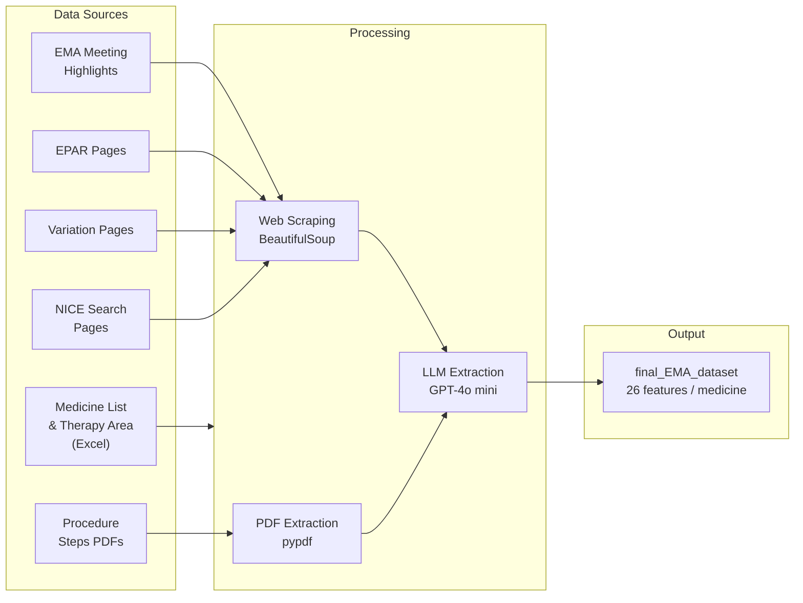

# Automated EMA & NICE Data Scraping


Automated pipeline for building a structured regulatory and HTA (Health Technology Assessment) database on medicines, by combining web scraping and LLM-based extraction from [EMA](https://www.ema.europa.eu) and [NICE](https://www.nice.org.uk).

---

## Pipeline



---

## Output Dataset

Each row represents one medicine from the latest CHMP Meeting Highlights. 26 features are collected per medicine across four categories.

### Identification

| Feature | Description | Source |
|---|---|---|
| `Product Name` | Brand name | CHMP Meeting Highlights |
| `INN` | Molecule (international non-proprietary name) | CHMP Meeting Highlights |
| `Marketing authorisation holder` | Company name | CHMP Meeting Highlights |
| `epar_url` | Link to EPAR page | Generated from product name |
| `variation_url` | Link to variation page | Scraped from CHMP news |
| `MH_url` | Link to Meeting Highlights news | CHMP Meeting Highlights |

### Clinical

| Feature | Description | Source |
|---|---|---|
| `Full Indication` | Full therapeutic indication (LLM-extracted) | EPAR page |
| `New indication HTML` | Newly added indication shown in **bold** (LLM-extracted) | Variation page |
| `New indication PDF` | Most recently added indication (LLM-extracted) | Procedure steps PDF |
| `Removed indication HTML` | Removed indication shown in ~~strikethrough~~ (LLM-extracted) | Variation page |
| `Therapy class` | ATC code (first 3 characters) | EPAR page or medicine list |
| `Therapy Area` | Mapped therapy area | Therapy area lookup table |
| `Cancer` | Whether oncology drug (L01/L02) | Derived from therapy class |
| `Orphan` | Orphan medicine designation | EMA medicine list |

### Regulatory Dates

| Feature | Description | Source |
|---|---|---|
| `Initial Approval` | Initial approval or extension of indication | CHMP Meeting Highlights |
| `CHMP Opinion Date` | Last day of CHMP meeting | CHMP Meeting Highlights |
| `Decision date` | European Commission decision date | EMA medicine list |
| `EMA date for extension` | Date of most recent extension (LLM-extracted) | Procedure steps PDF |
| `title` | Title of CHMP Meeting Highlights news | CHMP Meeting Highlights |
| `date` | Date of CHMP Meeting Highlights news | CHMP Meeting Highlights |

### NICE Comparison

| Feature | Description | Source |
|---|---|---|
| `Search Result in NICE` | Whether medicine appears in NICE search | NICE search page |
| `NICE_url` | NICE search URL for the medicine | Generated from INN |
| `Full Indication Similarity` | Similarity between EMA full indication and NICE text (LLM-scored) | NICE page + EMA |
| `New Indication HTML Similarity` | Similarity between new indication (HTML) and NICE text (LLM-scored) | NICE page + EMA |
| `New Indication PDF Similarity` | Similarity between new indication (PDF) and NICE text (LLM-scored) | NICE page + EMA |

---

## Project Structure

```
├── notebooks/
│   └── EMA_data_scraping.ipynb      # Main notebook (Colab or local Jupyter)
├── scripts/
│   ├── config.py                    # HTTP headers, timeouts, OpenAI client
│   ├── llm.py                       # Single model entry point: retries, size guard
│   ├── http_utils.py                # Fetching + trimming pages before the LLM sees them
│   ├── ema_meeting_highlights.py    # Finds the latest CHMP news item and its links
│   ├── extractors.py                # All six extraction/comparison prompts
│   ├── batch.py                     # Runs one extractor over a list of URLs
│   ├── build_dataset.py             # End-to-end assembly of the dataset
│   ├── scrape_data_fromMH_with_LLM.py  # One record per medicine
│   ├── scrape_data_fromEPAR.py      # Therapy class / area from the EPAR page
│   ├── scrape_data_fromNICE.py      # NICE search hit check
│   ├── scrape_data_fromSHEET.py     # Medicine list lookup
│   ├── scrape_therapy_area.py       # Therapy area lookup
│   ├── compare_nice_and_indication.py
│   ├── text_fromNICE.py
│   ├── extract_text_from_pdf.py
│   └── get_chmp_opinion_date.py
├── tests/
│   ├── fetch_fixtures.py            # Re-downloads the saved pages
│   ├── fixtures/                    # Saved EMA/NICE pages (gzipped)
│   └── test_*.py                    # Offline regression tests
├── evaluation/
│   ├── metrics.py                   # ROUGE + exact match + classification metrics
│   ├── grounding.py                 # Label-free: is every answer really on the page?
│   ├── cross_check.py               # Label-free: does it match EMA's own exports?
│   ├── evaluate.py                  # Scores a run against a gold file
│   └── gold_template.csv            # Shape of the hand-checked reference file
├── data/
│   ├── medicines_output_medicines_en.xlsx   # EMA medicine list
│   └── therapy_area.xlsx                    # Therapy area lookup table
└── results/
    └── final_EMA_dataset.xlsx       # Output dataset
```

---

## Setup

```bash
pip install -r requirements.txt
cp .env.example .env        # then add your OpenAI key
```

The pipeline reads `OPENAI_API_KEY` from the environment. In Colab, store it as a
notebook secret; the setup cell copies it into `os.environ`.

The EMA medicines table is downloaded from
[EMA's medicine data page](https://www.ema.europa.eu/en/medicines/download-medicine-data)
(now published as `medicines-output-medicines-report_en.xlsx`). The real header row
of that export sits on row 9, hence `header=8`.

---

## Checking a run

Three layers, only the last of which needs hand-labelled answers.

**1. Regression tests — no labels.** The pipeline broke because EMA changed their
markup, not because the model got worse. Saved pages in `tests/fixtures/` pin the
structure the scrapers depend on, so a redesign fails a test instead of producing
an empty file.

```bash
pytest tests/                       # 23 tests, offline, ~2s
python tests/fetch_fixtures.py      # refresh the saved pages
```

**2. Grounding and cross-checks — no labels.** Every indication field is an
*extraction*, so the answer is already on the page and can be verified without a
reference dataset.

```bash
python evaluation/cross_check.py results/final_EMA_dataset.xlsx
```

`cross_check.py` compares the dataset against EMA's own published exports — the
post-authorisation table validates which medicines had an extension and on what
date, and the medicines table validates the Commission decision dates.
`evaluation/grounding.py` checks that every extracted phrase actually appears in
the source page, and scores the bold/strikethrough fields against the markup
pulled straight out of the HTML.

**3. Scored against a gold file — needs labels.** Once layers 1 and 2 have run,
only a handful of rows per meeting need a human look. The model is asked for three
different kinds of answer, so three different metrics apply:

| Output | Task | Metric |
|---|---|---|
| The four indication fields | Copy wording verbatim off the page | **Exact match** after normalisation, with ROUGE-1/2/L and token precision/recall alongside |
| `EMA date for extension` | Read one date | **Exact match**, format-tolerant |
| The three similarity fields | Yes/no judgement | **Accuracy, precision, recall, F1, Cohen's kappa** |

ROUGE alone is not sufficient for the indication fields: an answer that flips a
negation ("is **not** indicated ... HER2-**negative**") still scores ROUGE-L ≈ 0.91
against the correct text. Exact match is the headline number, ROUGE says how near
the misses were, and precision/recall separate invented text from dropped text.

`Search Result in NICE` is not scored here — no model is involved, and it is
covered by the tests in layer 1.

Copy `evaluation/gold_template.csv`, fill it in by hand for a sample of medicines,
then:

```bash
python evaluation/evaluate.py results/final_EMA_dataset.xlsx evaluation/gold.csv
```

---


---

## Objectives

- Build a consistent database of regulatory and HTA guidance on medicines for analysis and statistics.
- Focus on stepwise data collection and automation from EMA and NICE sources.

## AI Utilization

- **Model**: GPT-4o mini — chosen for speed efficiency over Llama 3.1. Pages are
  trimmed to the relevant section before being sent, so a request stays well inside
  the context window (an untrimmed Keytruda EPAR page is ~200k tokens).
- **Tasks**: Extracts structured data from unstructured sources — HTML (bold/strikethrough text), PDFs (procedure steps), and NICE web pages (indication similarity scoring).
- **Output**: Structured Excel/CSV file with 26 features per medicine for downstream analysis.
