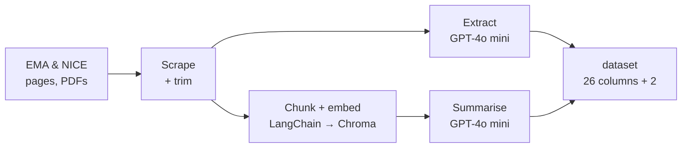

# Automated EMA & NICE Data Scraping


Automated pipeline for building a structured regulatory and HTA (Health Technology Assessment) database on medicines, by combining web scraping, LLM-based extraction and retrieval-grounded summarisation from [EMA](https://www.ema.europa.eu) and [NICE](https://www.nice.org.uk).

---

## Pipeline



---

## Output Dataset

Each row represents one medicine from the latest CHMP Meeting Highlights. 26 features are collected per medicine across four categories, plus two more when the summary step has run.

### Identification

| Feature | Description | Source |
|---|---|---|
| `Product Name` | Brand name | CHMP Meeting Highlights |
| `INN` | Molecule (international non-proprietary name) | CHMP Meeting Highlights |
| `Marketing authorisation holder` | Company name | CHMP Meeting Highlights |
| `epar_url` | Link to EPAR page | Generated from product name |
| `variation_url` | Link to variation page | Scraped from CHMP news |
| `MH_url` | Link to Meeting Highlights news | CHMP Meeting Highlights |

### Clinical

| Feature | Description | Source |
|---|---|---|
| `Full Indication` | Full therapeutic indication (LLM-extracted) | EPAR page |
| `New indication HTML` | Newly added indication shown in **bold** (LLM-extracted) | Variation page |
| `New indication PDF` | Most recently added indication (LLM-extracted) | Procedure steps PDF |
| `Removed indication HTML` | Removed indication shown in ~~strikethrough~~ (LLM-extracted) | Variation page |
| `Therapy class` | ATC code (first 3 characters) | EPAR page or medicine list |
| `Therapy Area` | Mapped therapy area | Therapy area lookup table |
| `Cancer` | Whether oncology drug (L01/L02) | Derived from therapy class |
| `Orphan` | Orphan medicine designation | EMA medicine list |

### Summary (optional — added by `summarise.add_summaries`)

| Feature | Description | Source |
|---|---|---|
| `What changed` | One or two plain sentences on what this meeting changed, with `[S#]` citations | Passages retrieved from the EPAR, variation and NICE pages |
| `Summary sources` | Which documents the retriever supplied for that summary | Retrieval metadata |

### Regulatory Dates

| Feature | Description | Source |
|---|---|---|
| `Initial Approval` | Initial approval or extension of indication | CHMP Meeting Highlights |
| `CHMP Opinion Date` | Last day of CHMP meeting | CHMP Meeting Highlights |
| `Decision date` | European Commission decision date | EMA medicine list |
| `EMA date for extension` | Date of most recent extension (LLM-extracted) | Procedure steps PDF |
| `title` | Title of CHMP Meeting Highlights news | CHMP Meeting Highlights |
| `date` | Date of CHMP Meeting Highlights news | CHMP Meeting Highlights |

### NICE Comparison

| Feature | Description | Source |
|---|---|---|
| `Search Result in NICE` | Whether medicine appears in NICE search | NICE search page |
| `NICE_url` | NICE search URL for the medicine | Generated from INN |
| `Full Indication Similarity` | Similarity between EMA full indication and NICE text (LLM-scored) | NICE page + EMA |
| `New Indication HTML Similarity` | Similarity between new indication (HTML) and NICE text (LLM-scored) | NICE page + EMA |
| `New Indication PDF Similarity` | Similarity between new indication (PDF) and NICE text (LLM-scored) | NICE page + EMA |

---

## Project Structure

```
├── notebooks/
│   ├── EMA_data_scraping.ipynb      # Main notebook (Colab or local Jupyter)
│   └── (Llama3_1)Experiment_...ipynb  # First RAG attempt: Ollama/HF + LangChain + Chroma
├── scripts/
│   ├── config.py                    # HTTP headers, timeouts, OpenAI client
│   ├── llm.py                       # Single model entry point: retries, size guard
│   ├── http_utils.py                # Fetching + trimming pages before the LLM sees them
│   ├── rag.py                       # Chunking, embedding and per-medicine retrieval
│   ├── summarise.py                 # The retrieval-grounded "What changed" summary
│   ├── ema_meeting_highlights.py    # Finds the latest CHMP news item and its links
│   ├── extractors.py                # All six extraction/comparison prompts
│   ├── batch.py                     # Runs one extractor over a list of URLs
│   ├── build_dataset.py             # End-to-end assembly of the dataset
│   ├── scrape_data_fromMH_with_LLM.py  # One record per medicine
│   ├── scrape_data_fromEPAR.py      # Therapy class / area from the EPAR page
│   ├── scrape_data_fromNICE.py      # NICE search hit check
│   ├── scrape_data_fromSHEET.py     # Medicine list lookup
│   ├── scrape_therapy_area.py       # Therapy area lookup
│   ├── compare_nice_and_indication.py
│   ├── text_fromNICE.py
│   ├── extract_text_from_pdf.py
│   └── get_chmp_opinion_date.py
├── tests/
│   ├── fetch_fixtures.py            # Re-downloads the saved pages
│   ├── fixtures/                    # Saved EMA/NICE pages (gzipped)
│   └── test_*.py                    # Offline regression tests
├── evaluation/
│   ├── metrics.py                   # ROUGE + exact match + classification + summary metrics
│   ├── grounding.py                 # Label-free: is every answer really on the page?
│   │                                #   and: did retrieval find what EMA marked up?
│   ├── cross_check.py               # Label-free: does it match EMA's own exports?
│   ├── evaluate.py                  # Scores a run against a gold file
│   ├── gold_template.csv            # Shape of the hand-checked reference file
│   └── gold_chmp_2026_07.csv        # Gold set for the July 2026 meeting (16 medicines)
├── data/
│   ├── medicines_output_medicines_en.xlsx   # EMA medicine list
│   └── therapy_area.xlsx                    # Therapy area lookup table
└── results/
    └── final_EMA_dataset.xlsx       # Output dataset
```

---

## Setup

```bash
pip install -r requirements.txt
cp .env.example .env        # then add your OpenAI key
```

The pipeline reads `OPENAI_API_KEY` from the environment. In Colab, store it as a
notebook secret; the setup cell copies it into `os.environ`.

`requirements.txt` includes the four retrieval packages
(`langchain-text-splitters`, `langchain-openai`, `langchain-chroma`, `chromadb`).
They are only used by the summary step — skip them and everything else still
imports and runs, and the retrieval tests skip themselves.

The EMA medicines table is downloaded from
[EMA's medicine data page](https://www.ema.europa.eu/en/medicines/download-medicine-data)
(now published as `medicines-output-medicines-report_en.xlsx`). The real header row
of that export sits on row 9, hence `header=8`.

---

## Retrieval, and why only the summary needs it

Every indication column is an **extraction**: the answer is already on the page,
word for word, and the prompt only has to copy it. `http_utils` narrows the page
to the relevant section and the whole thing goes into the prompt. There is
nothing to search for, so those columns use no retrieval at all.

`What changed` is the exception. It has to read across a whole EPAR, the
variation diff and the NICE result and say in a sentence what a meeting
changed — and that does not fit. An untrimmed Keytruda EPAR page is ~200k
tokens, so the size guard in `llm.truncate` starts cutting, and whatever it cuts
is silently gone. That one step retrieves instead:

```
EMA + NICE pages ─▶ to_markers ─▶ RecursiveCharacterTextSplitter ─▶ OpenAIEmbeddings
                                       1200 / 200                 text-embedding-3-small
                                                                         │
                     numbered, citable context ◀── top-4, filtered ───────┴─▶ Chroma
                                 │                  by product
                                 ▼
                           GPT-4o mini ─▶ `What changed` + `Summary sources`
```

The first attempt at this is in
[`notebooks/(Llama3_1)Experiment_Ollama_+_Langchain__etc.ipynb`](notebooks/), on
Ollama/Llama 3.1 and Hugging Face embeddings. It was abandoned, and the note in
that notebook says why: *"All text on web pages is extracted as plain text and
stored as vectors, ignoring bold or strikethrough formatting. This makes it
difficult to extract new indications from those pages."* The two fixes for that
are the whole of the current design:

- **The markup is the signal.** EMA marks a newly added indication in bold and a
  removed one in strikethrough, and a plain-text loader throws that away. Once it
  is gone, no amount of retrieval can tell an added indication from the paragraph
  around it. `rag.to_markers` rewrites `<strong>`/`<s>` into literal
  `[ADDED]`/`[REMOVED]` markers **before** chunking, so the distinction survives
  embedding, retrieval and the prompt. The markers are chunk separators too, so a
  boundary lands before a marked-up span rather than inside one.
- **Retrieval is scoped to one medicine.** Chunks carry the product name in their
  metadata and every search filters on it. Without that filter, medicines
  recommended at the same meeting share far too much vocabulary — "advanced
  non-small cell lung cancer" retrieves the wrong drug's indication.

The marked-up fragments are pinned into the prompt regardless of what the search
returns: they are short, and they are the one thing a summary must not miss. The
prompt numbers each passage `[S1]`, `[S2]`, … and asks for a citation per
sentence, which is what makes the citation rate below measurable — an uncited
sentence is one the model did not get from the sources.

```python
from build_dataset import build_ema_dataset
from summarise import add_summaries

pages = {}                       # keeps the markup of every page the run fetched
df = build_ema_dataset(pdf_paths, therapy_area_df, medicines_df, pages=pages)
add_summaries(df, pages, nice_text_dict)     # indexes those pages, no refetching
```

This is the only step that needs the four retrieval packages listed under
[Setup](#setup). Nothing else in the pipeline imports them.

---

## Checking a run

Three layers, only the last of which needs hand-labelled answers.

**1. Regression tests — no labels.** The pipeline broke because EMA changed their
markup, not because the model got worse. Saved pages in `tests/fixtures/` pin the
structure the scrapers depend on, so a redesign fails a test instead of producing
an empty file.

```bash
pytest tests/                       # 76 tests, offline, ~3s
python tests/fetch_fixtures.py      # refresh the saved pages
```

**2. Grounding and cross-checks — no labels.** Every indication field is an
*extraction*, so the answer is already on the page and can be verified without a
reference dataset.

```bash
python evaluation/cross_check.py results/final_EMA_dataset.xlsx
```

`cross_check.py` compares the dataset against EMA's own published exports — the
post-authorisation table validates which medicines had an extension and on what
date, and the medicines table validates the Commission decision dates.
`evaluation/grounding.py` checks that every extracted phrase actually appears in
the source page, and scores the bold/strikethrough fields against the markup
pulled straight out of the HTML.

The summary needs its own version of the same idea, because it is the one output
allowed to rephrase. `grounding.py` also reports, still with no labels:

```python
from grounding import check_retrieval, check_summaries, mean_recall

log = {}                                       # add_summaries(..., retrieval_log=log)
mean_recall(check_retrieval(df, log, pages))   # did the search find what EMA marked up?
check_summaries(df, log)                       # is each summary built from its passages?
```

- **Retrieval recall** — of the spans EMA marked up, how many the search
  surfaced. The bold markup *is* the ground truth for what changed, so this
  needs no reference dataset.
- **`supported_fraction`** — how much of the summary's vocabulary appears in the
  passages it was given. Catches the failure ROUGE cannot see: a fluent sentence
  about a trial result no source mentioned.
- **`citation_rate`** — how many sentences cite a passage that was really
  retrieved. `[S9]` against four passages counts as uncited.

**3. Scored against a gold file — needs labels.** Once layers 1 and 2 have run,
only a handful of rows per meeting need a human look. The model is asked for four
different kinds of answer, so four different metrics apply:

| Output | Task | Metric |
|---|---|---|
| The four indication fields | Copy wording verbatim off the page | **Exact match** after normalisation, with ROUGE-1/2/L and token precision/recall alongside |
| `EMA date for extension` | Read one date | **Exact match**, format-tolerant |
| The three similarity fields | Yes/no judgement | **Accuracy, precision, recall, F1, Cohen's kappa** |
| `What changed` | Write a summary | **ROUGE-1/2/L** against a reference summary written by a health economist, reported next to the two label-free numbers from layer 2 |

ROUGE alone is not sufficient for the indication fields: an answer that flips a
negation ("is **not** indicated ... HER2-**negative**") still scores ROUGE-L ≈ 0.91
against the correct text. Exact match is the headline number, ROUGE says how near
the misses were, and precision/recall separate invented text from dropped text.

The summary is the only output with no single correct wording, which is what
ROUGE is actually for — and the only one that can invent something, which is why
it is never scored on ROUGE alone. The reference summaries go in the same gold
file, in a `What changed` column.

`Search Result in NICE` is not scored here — no model is involved, and it is
covered by the tests in layer 1.

`evaluation/gold_chmp_2026_07.csv` is a gold set for the 20–23 July 2026 meeting:
all 16 medicines, with `What changed` written for every one and the two diff
columns taken straight off the markup. `Full Indication`, the similarity
judgements and the PDF columns are still blank there. It is written from the
public EMA pages as a worked example — see limitation 1 for why the references
this was actually evaluated against are not in this repository.

```bash
python evaluation/evaluate.py results/final_EMA_dataset.xlsx evaluation/gold_chmp_2026_07.csv
```

To start one for a different meeting, copy `evaluation/gold_template.csv` and
fill it in. Two of its columns need no judgement at all: EMA's bold and
strikethrough *are* the answer for `New indication HTML` and
`Removed indication HTML`, so they can be lifted straight off the variation page
with `grounding.marked_up_fragments`. Everything else is annotation.

The report prints `labelled=` next to `n=` for the extraction columns. A blank
reference and a blank prediction score 1.0, correctly — "there was nothing to
extract" is an answer the model can get right — but that also means an
unannotated column would otherwise report a perfect score off no evidence, so
read the two numbers together.

---

## Known limitations and future work

Written after the fact, knowing where this actually falls down. Roughly in the
order worth fixing.

### 1. The gold set here is a stand-in, by necessity

The reference summaries that would turn this from a demonstration into a
measurement are internal material and cannot be published in a personal
repository. So this repository does not carry them, and quotes no number derived
from them.

`evaluation/gold_chmp_2026_07.csv` is a substitute, written from the public EMA
pages for the 20–23 July 2026 meeting and checked by hand against each
medicine's EPAR overview or variation diff, so that anyone who clones this can
run layer 3 end to end and see what it reports. It covers 16 medicines:
`What changed` for all of them, and the two diff columns off the markup. Treat
it as a worked example of the evaluation, not as its result.

Three of its columns are still empty, each for its own reason. `Full Indication`
is the slow one — Keytruda's indication section runs to ~39,000 characters and
deciding what the answer is *is* the annotation. The three similarity columns
are yes/no judgements. `New indication PDF` and `EMA date for extension` need
the procedural steps PDFs from limitation 3.

If you do want a number out of this repository rather than out of the method,
**target ~30–50 annotated medicines, which is two to three consecutive
meetings.** The trap is that rows
are not the same as `n` per column: a meeting is around 16 medicines, but only
the extensions have a variation page, so on the fixture meeting the diff columns
would get `n=8` out of 16 rows — which is what the committed gold set shows, at
`labelled=7` and `labelled=3`. At an observed 90%, a Wilson 95% interval is
±0.21 at n=8, ±0.15 at n=16, ±0.11 at n=30 and ±0.09 at n=50, so one meeting
tells you whether a column is broken and three let you quote a figure.

Annotate for spread rather than convenience: both first authorisations and
extensions, oncology and not, NICE hit and NICE miss, and deliberately include
the medicines whose diff is many small fragments, since those are what the
summary step exists for.

Separately, any NICE-similarity figure produced before commit `bfdadd4` is wrong.
`N/A` answers were scored as an explicit "No" instead of being excluded, which
skews accuracy, precision, recall, F1 and kappa on all three similarity columns.
Those have to be re-run, not just quoted.

### 2. `supported_fraction` is lexical, not semantic

It measures how much of a summary's vocabulary appears in the retrieved passages.
That catches an invented trial result, but it is the wrong shape for the job in
both directions: a correct paraphrase that uses different words scores low, and a
false claim assembled out of words that *are* in the sources scores high. An
entailment check (NLI, or a second model asked whether each sentence follows from
its cited passage) is the version this should have been.

### 3. The automation stops short of the PDFs

`New indication PDF` and `EMA date for extension` come from EMA's *procedural
steps* PDFs, which have to be downloaded by hand into a folder before a run — EMA
does not link them anywhere the scraper can follow predictably. Skip that step and
both columns are `N/A` for every medicine. So the pipeline is automated over the
EPAR, variation and NICE pages, and not over the PDFs. EMA's document search, or
the document table on each EPAR page, is where a fix would start.

### 4. The NICE side is shallower than it looks

The similarity columns compare an EMA indication against the NICE **search results
page**, not against the guidance document. That is why they read as "does a NICE
result look related", not "NICE has appraised this indication". Following the top
result into the guidance itself and comparing against that would turn these
columns from a hint into an answer.

### 5. Retrieval was never tuned

Every retrieval parameter is a first guess carried over from the original
notebook: chunk size 1200, overlap 200, top-4, one fixed query string.
`check_retrieval` exists precisely to measure the effect of changing them — recall
against EMA's own markup, no labels needed — but it has only been exercised
against a stub embedder, so no real recall figure exists yet. Three specific gaps:

- `add_summaries` does not expose `k`; changing it means editing `rag.TOP_K` or
  building the `Retriever` yourself.
- The index is rebuilt in memory on every run. `build_store(persist_dir=...)`
  supports persistence and nothing uses it.
- A hybrid search — embeddings plus a keyword match on the `[ADDED]`/`[REMOVED]`
  markers — is the obvious thing to try next, since those markers are exact
  strings rather than something the embedding has to approximate.

### 6. One meeting at a time

The pipeline only ever reads the most recent Meeting Highlights. Any trend
question — how long the EMA-to-NICE lag is, how it varies by therapy area — needs
a backfill over past meetings, and nothing here does that.

---

## Objectives

- Build a consistent database of regulatory and HTA guidance on medicines for analysis and statistics.
- Focus on stepwise data collection and automation from EMA and NICE sources.

## AI Utilization

- **Model**: GPT-4o mini — chosen for speed efficiency over Llama 3.1. Pages are
  trimmed to the relevant section before being sent, so a request stays well inside
  the context window (an untrimmed Keytruda EPAR page is ~200k tokens).
- **Embeddings**: `text-embedding-3-small`, over EMA and NICE pages chunked with
  LangChain and indexed in Chroma.
- **Tasks**:
  - *Extraction* — structured data out of unstructured sources: HTML
    (bold/strikethrough text), PDFs (procedure steps), and NICE web pages
    (indication similarity scoring). No retrieval; the answer is on the page.
  - *Summarisation* — one plain-English sentence per medicine on what the meeting
    changed, written only from retrieved passages and cited back to them.
- **Evaluation**: exact match for the extractions, ROUGE-1/2/L for the summaries
  against reference summaries, and three label-free checks — grounding, retrieval
  recall against EMA's own markup, and the summary's supported fraction.
- **Output**: Structured Excel/CSV file with 26 features per medicine (28 with the
  summary columns) for downstream analysis.
