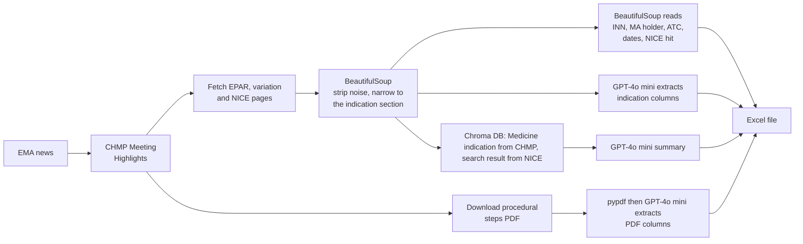

# Automated EMA & NICE Data Scraping


Automated pipeline for building a structured regulatory and HTA (Health Technology Assessment) database on medicines, by combining web scraping, LLM-based extraction and retrieval-grounded summarisation from [EMA](https://www.ema.europa.eu) and [NICE](https://www.nice.org.uk).

---

## AI Utilization

- **GPT-4o mini**. It does two jobs: extracting structured fields from EMA pages, PDFs and NICE pages, and writing the
  `What changed` summary.
- **Zero-shot prompting**. Every prompt in `scripts/extractors.py` is
  instruction-only, with no worked examples, and runs at `temperature=0`. The
  answers are spans copied off the page, so what the model needs is where to
  look and what format to reply in, not an example to imitate.
- **`text-embedding-3-small`** - This chunks EMA and NICE pages with LangChain
  and indexed in Chroma. Used by the summary step.
- **Evaluation**. Three types: exact match for the extractions, binary classification, ROUGE-1/2/L for the
  summaries.
- **Output**. An Excel file, `results/final_EMA_dataset.xlsx`, with 27 columns per
  medicine. A CSV is written earlier in the run as a checkpoint, before the NICE
  similarity and summary steps, so it holds 22 of those columns rather than all of them.


## Pipeline



Three things in that diagram are easy to get backwards:

- **BeautifulSoup and the model are not alternatives.** Trimming runs *first* and
  produces the input the model reads. The raw Keytruda EPAR is 132,209 tokens,
  past the 128k window, and 16,761 after narrowing. What splits the work after
  that is the shape of the data, not what either tool is capable of: fields with
  a fixed position in the DOM (`dt`/`dd` pairs, the ATC code, links, the NICE
  result title) are read by BeautifulSoup, and free prose that no selector can
  address (the indication sentence, the diff, the PDF table) goes to the model.
- **The vector store is fed from `pages`, not from the extracted columns.** The
  summary re-reads the trimmed pages independently, so an extraction error
  cannot propagate into it, and `grounding.py` can score the two separately.
- **The PDF never enters the vector store.** Its text goes straight into the two
  PDF prompts and stops there.

---

## Output Dataset

Each row represents one medicine from the latest CHMP Meeting Highlights. 25 features are collected per medicine across four categories, plus two more when the summary step has run.

### Identification

| Feature | Description | Source |
|---|---|---|
| `Product Name` | Brand name | CHMP Meeting Highlights |
| `INN` | Molecule (international non-proprietary name) | CHMP Meeting Highlights |
| `Marketing authorisation holder` | Company name | CHMP Meeting Highlights |
| `epar_url` | Link to EPAR page | Generated from product name |
| `variation_url` | Link to variation page | Scraped from CHMP news |
| `MH_url` | Link to Meeting Highlights news | CHMP Meeting Highlights |

### Clinical

| Feature | Description | Source |
|---|---|---|
| `Full Indication` | Full therapeutic indication (LLM-extracted) | EPAR page |
| `New indication HTML` | Newly added indication shown in **bold** (LLM-extracted) | Variation page |
| `New indication PDF` | Most recently added indication (LLM-extracted) | Procedure steps PDF |
| `Removed indication HTML` | Removed indication shown in ~~strikethrough~~ (LLM-extracted) | Variation page |
| `Therapy class` | ATC code (first 3 characters) | EPAR page or medicine list |
| `Therapy Area` | Mapped therapy area | Therapy area lookup table |
| `Cancer` | Whether oncology drug (L01/L02) | Derived from therapy class |
| `Orphan` | Orphan medicine designation | EMA medicine list |

### Summary (optional, added by `summarise.add_summaries`)

| Feature | Description | Source |
|---|---|---|
| `What changed` | One or two plain sentences on what this meeting changed, with `[S#]` citations | Passages retrieved from the EPAR, variation and NICE pages |
| `Summary sources` | Which documents the retriever supplied for that summary | Retrieval metadata |

### Regulatory Dates

| Feature | Description | Source |
|---|---|---|
| `Initial Approval` | Initial approval or extension of indication | CHMP Meeting Highlights |
| `CHMP Opinion Date` | Last day of CHMP meeting | CHMP Meeting Highlights |
| `Decision date` | European Commission decision date | EMA medicine list |
| `EMA date for extension` | Date of most recent extension (LLM-extracted) | Procedure steps PDF |
| `title` | Title of CHMP Meeting Highlights news | CHMP Meeting Highlights |
| `date` | Date of CHMP Meeting Highlights news | CHMP Meeting Highlights |

### NICE Comparison

| Feature | Description | Source |
|---|---|---|
| `Search Result in NICE` | Whether medicine appears in NICE search | NICE search page |
| `NICE_url` | NICE search URL for the medicine | Generated from INN |
| `Full Indication Similarity` | Similarity between EMA full indication and NICE text (LLM-scored) | NICE page + EMA |
| `New Indication HTML Similarity` | Similarity between new indication (HTML) and NICE text (LLM-scored) | NICE page + EMA |
| `New Indication PDF Similarity` | Similarity between new indication (PDF) and NICE text (LLM-scored) | NICE page + EMA |

---

## Project Structure

```
├── run_pipeline.py                  # Terminal entry point; same steps as the notebook
├── notebooks/
│   ├── EMA_data_scraping.ipynb      # Main notebook (Colab or local Jupyter)
│   └── (Llama3_1)Experiment_...ipynb  # First RAG attempt: Ollama/HF + LangChain + Chroma
├── scripts/
│   ├── config.py                    # HTTP headers, timeouts, OpenAI client
│   ├── llm.py                       # Single model entry point: retries, size guard
│   ├── http_utils.py                # Fetching + trimming pages before the LLM sees them
│   ├── rag.py                       # Chunking, embedding and per-medicine retrieval
│   ├── summarise.py                 # The retrieval-grounded "What changed" summary
│   ├── ema_meeting_highlights.py    # Finds the latest CHMP news item and its links
│   ├── extractors.py                # All six extraction/comparison prompts
│   ├── batch.py                     # Runs one extractor over a list of URLs
│   ├── build_dataset.py             # End-to-end assembly of the dataset
│   ├── scrape_data_fromMH_with_LLM.py  # One record per medicine
│   ├── scrape_data_fromEPAR.py      # Therapy class / area from the EPAR page
│   ├── scrape_data_fromNICE.py      # NICE search hit check
│   ├── scrape_data_fromSHEET.py     # Medicine list lookup
│   ├── scrape_therapy_area.py       # Therapy area lookup
│   ├── compare_nice_and_indication.py
│   ├── text_fromNICE.py
│   ├── extract_text_from_pdf.py
│   ├── download_procedural_pdf.py   # Finds and fetches the procedural steps PDF
│   └── get_chmp_opinion_date.py
├── tests/
│   ├── fetch_fixtures.py            # Re-downloads the saved pages
│   ├── fixtures/                    # Saved EMA/NICE pages (gzipped)
│   └── test_*.py                    # Offline regression tests
├── evaluation/
│   ├── metrics.py                   # ROUGE + exact match + classification + summary metrics
│   ├── grounding.py                 # Label-free: is every answer really on the page?
│   │                                #   and: did retrieval find what EMA marked up?
│   ├── cross_check.py               # Label-free: does it match EMA's own exports?
│   ├── evaluate.py                  # Scores a run against a gold file
│   ├── gold_template.csv            # Shape of the hand-checked reference file
│   └── gold_chmp_2026_07.csv        # Gold set for the July 2026 meeting (16 medicines)
├── data/
│   ├── medicines_output_medicines_en.xlsx   # EMA medicine list
│   └── therapy_area.xlsx                    # Therapy area lookup table
└── results/
    └── final_EMA_dataset.xlsx       # Output dataset
```

---

## Set Up

Two ways in, depending on who is running it. Both do the same work in the same
order, and both write `results/final_EMA_dataset.xlsx`.

### In the browser, with no install

[](https://colab.research.google.com/github/yumi-h-1/Automated-EMA-NICE-Data-Scraping/blob/main/notebooks/EMA_data_scraping.ipynb)

Open `notebooks/EMA_data_scraping.ipynb` in Colab and run the cells. The setup
cell clones this repository and installs everything, so nothing has to be
installed locally. Store your key as a Colab secret named `OPENAI_API_KEY`; the
setup cell copies it into `os.environ`.

This is the path to send someone who just wants the spreadsheet.

### From the terminal

```bash
git clone https://github.com/yumi-h-1/Automated-EMA-NICE-Data-Scraping
cd Automated-EMA-NICE-Data-Scraping

python3 -m venv .venv && source .venv/bin/activate
pip install -r requirements.txt

cp .env.example .env        # add your OpenAI key; config.py loads this file
python run_pipeline.py
```

`run_pipeline.py` calls the same functions the notebook calls in the same order.

### Dependencies

`OPENAI_API_KEY` is required for the extraction, comparison and summary.

The EMA medicines table is downloaded on every run from
[EMA's medicine data page](https://www.ema.europa.eu/en/medicines/download-medicine-data)
(published as `medicines-output-medicines-report_en.xlsx`). This file seems to be changed by EMA weekly.

The procedural steps PDFs behind `New indication PDF` and `EMA date for extension`
are downloaded by the run itself from the link on each medicine's EPAR page. 
If you place a PDF file directly in `data/ema_pdf/`, that file will be used instead.

---

## Retrieval

Every indication column is an **extraction**, meaning the answer is on the page
word for word, so the trimmed page goes straight into the prompt and nothing is
searched.

`What changed` is the summary from an AI, so retrieval is there to keep the summary tied to the pages it came from.
The model is given numbered passages pulled from those pages and nothing else, and it has to cite one per sentence.
A sentence with no citation is a sentence it did not get from a source.

```
pages ─▶ to_markers ─▶ RecursiveCharacterTextSplitter ─▶ OpenAIEmbeddings ─▶ Chroma
                            1200 / 200               text-embedding-3-small      │
     GPT-4o mini ◀── numbered, citable context ◀── top-4, filtered by product ───┘
```

- **The markup is the signal.** `rag.to_markers` rewrites `<strong>`/`<s>` into
  `[ADDED]`/`[REMOVED]` before chunking, so EMA's diff survives embedding and
  retrieval. The markers are chunk separators too, so a boundary never lands
  inside a span.
- **Search is scoped to one medicine**, on product name in the chunk metadata.
  Without it, medicines from the same meeting share too much vocabulary and the
  wrong drug's indication comes back.

The marked-up fragments are pinned into the prompt whatever the search returns.
Passages are numbered `[S1]`, `[S2]`, … and the prompt requires a citation per
sentence, so an uncited sentence is one the model did not get from the sources.

Only this step needs the retrieval packages from [Setup](#setup).

---

## Checking a run

Three layers; only the last needs labels.

**1. Regression tests.** The pipeline breaks when EMA changes their markup, not
when the model has a bad day. Saved pages in `tests/fixtures/` pin the structure
the scrapers depend on, so a redesign fails a test instead of producing an empty
file.

```bash
pytest tests/                       # 80 tests, offline, ~3s
python tests/fetch_fixtures.py      # refresh the saved pages
```

**2. Grounding and cross-checks, with no labels.** `cross_check.py` compares the
dataset with EMA's own published exports: the post-authorisation table validates
which medicines had an extension and when, the medicines table validates the
Commission decision dates. `grounding.py` checks that every extracted phrase is
really on the page, and scores the bold/strikethrough columns against the markup
itself.

```bash
python evaluation/cross_check.py results/final_EMA_dataset.xlsx
```

The summary needs its own version of this, being the one output allowed to
rephrase. `grounding.check_retrieval` and `check_summaries` report:

- **Retrieval recall**: of the spans EMA marked up, how many the search found.
- **`supported_fraction`**: how much of the summary's vocabulary is in the
  passages it was given. Catches what ROUGE cannot: a fluent sentence about a
  trial result no source mentioned.
- **`citation_rate`**: sentences citing a passage that was really retrieved.

**3. Scored against a gold file, which needs labels.** Four kinds of answer, four
metrics:

| Output | Metric |
|---|---|
| The four indication fields | **Exact match**, with ROUGE-1/2/L and token precision/recall alongside |
| `EMA date for extension` | **Exact match**, format-tolerant |
| The three similarity fields | **Accuracy, precision, recall, F1** |
| `What changed` | **ROUGE-1/2/L** against a reference summary, read next to the label-free numbers above |

ROUGE is never the headline. An answer that flips a negation ("is **not**
indicated … HER2-**negative**") still scores ROUGE-L ≈ 0.91 against the correct
text, so exact match leads for the extractions, and the summary, the one output
with no single correct wording, is read beside `supported_fraction`.

```bash
python evaluation/evaluate.py results/final_EMA_dataset.xlsx evaluation/gold_chmp_2026_07.csv
```

`gold_chmp_2026_07.csv` covers the 16 medicines of the July 2026 meeting, hand
annotated across every scored column: `Full Indication` and `What changed` for
each medicine, the diff columns and `EMA date for extension` where the meeting
produced one, and the NICE yes/no judgements where a NICE page exists. `N/A`
means "there was nothing to annotate here", and the report counts it as
unlabelled rather than as a blank answer the model got right. For another
meeting, copy `gold_template.csv`. `grounding.marked_up_fragments` gives you the
two diff columns, and the rest is annotation.

The report prints `labelled=` beside `n=`. A blank reference against a blank
prediction scores 1.0, correctly, but an unannotated column is all blanks too and
would otherwise look perfect off no evidence.

`unparseable_rate` sits beside the date and yes/no numbers. It is the share of
*labelled* rows where the pipeline's own answer could not be read as an answer at
all: a date in no recognised format, or a NICE judgement that came back blank
instead of Yes/No. It separates "the model was wrong" from "the model said
nothing", which accuracy alone merges into a single failure.

### Results, July 2026 meeting

16 medicines, scored against `gold_chmp_2026_07.csv`. `n` is the medicines
scored, `labelled` the ones the gold file has an answer for.

**Verbatim extraction.** Exact match is the headline; ROUGE says how near the
misses were.

| Field | labelled | Exact match | ROUGE-L | Token precision | Token recall |
|---|---|---|---|---|---|
| `Full Indication` | 16 | 0.500 | 0.858 | 0.980 | 0.811 |
| `New indication HTML` | 6 | 0.875 | 0.935 | 0.933 | 0.938 |
| `New indication PDF` | 3 | 0.500 | 0.599 | 0.688 | 0.568 |
| `Removed indication HTML` | 2 | 0.688 | 0.688 | 0.688 | 0.688 |

`Full Indication` is the pattern worth reading: precision 0.980 against recall
0.811 means the text it returns is almost always really on the page, and what it
loses it loses by stopping early. That is the failure you want of the two, and it
is why exact match sits at 0.500 while ROUGE-L is 0.858 — most misses are a
truncated indication, not an invented one. The PDF column is the weakest, and the
smallest: 3 labels is a sample to read by hand, not a number to quote.

**Dates and yes/no judgements.**

| Field | n | Accuracy | Precision | Recall | F1 | Unparseable |
|---|---|---|---|---|---|---|
| `EMA date for extension` | 3 | 0.667 | — | — | — | 0.000 |
| `Search Result in NICE` | 9 | 0.667 | 1.000 | 0.667 | 0.800 | 0.333 |
| `Full Indication Similarity` | 8 | 0.625 | 1.000 | 0.625 | 0.769 | 0.000 |

Both yes/no fields have precision 1.000 with recall around 0.65: every Yes it
gives is right, and it misses about a third of them. For `Search Result in NICE`
the whole gap is the `unparseable_rate` of 0.333 — three medicines where the
lookup returned nothing at all rather than a wrong answer, so the fix is in
retrieval, not in the judgement. Note also that the gold file has no `No` rows
for these fields, so precision is measured against no negatives; it says the Yes
answers are right, not that the model would refuse a bad match.

**Summary.** `What changed`, all 16 labelled: ROUGE-1 0.554, ROUGE-2 0.394,
ROUGE-L 0.502. This is the number to trust least on its own, for the reason
above, and it is read next to `supported_fraction` and `citation_rate` from
`grounding.py`.

One meeting of 16 medicines is a small sample, and four of the columns above rest
on 6 labels or fewer. These are the numbers for this run, not a general claim
about the pipeline.

---
